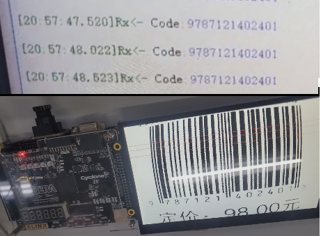

# 工程环境

+ FPGA开发板 ：AX301 （Cyclone IV )
+ PC 串口助手
+ 摄像头：OV5640
+ 屏幕：直插LCD 800x480 @ 60fps

# 下载现象

+ 使用固定图片进行识别，不同行业物品的编码规则并不完全通用，以下为前置码为9时的编码识别，用于图书等物品。
+ 识别尽可能填满左右屏幕，并在红色识别线上。
+ 由于共需要94个比特识别，屏幕分辨率建议不低于600，每个比特才有约5个像素的有效识别范围。

# 版本更新

+ 20230423：初始版本，未整理黑金冗余代码啥的，勉强能用

