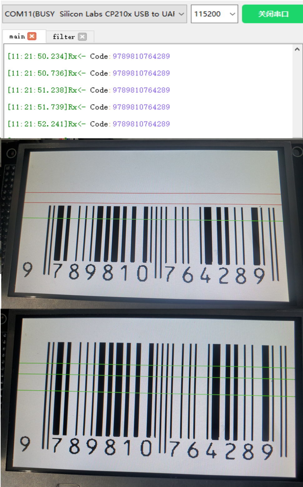

# 工程环境

+ FPGA开发板 ：AX301 （Cyclone IV )
+ PC 串口助手
+ 屏幕：直插LCD 480x272 @ 60fps

# 下载现象

+ 使用固定图片进行识别，不同行业物品的编码规则并不完全通用，以下为前置码为9时的编码识别，用于图书等物品。

# 版本更新

+ 20230423：初始版本
+ 20230425：将连续识别三个位置，有一个成功就行，提高容错率
+ 20230425：拆分识别代码，优化时序

