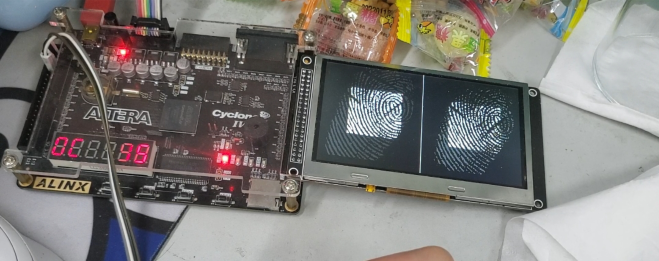

# 工程环境

+ FPGA开发板 ：AX301 （Cyclone IV )
+ 指纹模块：AS608
+ 屏幕：直插LCD 480x272 @ 60fps

+ 带sim后缀的工程文件夹仅用于仿真，跑得快点

# 下载现象

- 手指按在指纹模块上，按按键扫描一次，再按一次按键进行匹配，手指在不松开的情况下最为理想。松开再按可能就很难匹配的上了（毕竟卷积算法比较简单
- 数码管上显示为当前的最优匹配度，随着卷积深入而增加，最后图像会定位到具体的位置

