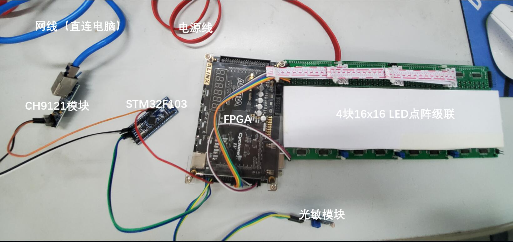
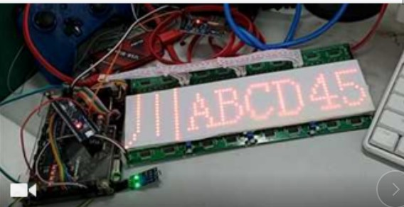

# 工程环境

+ FPGA开发板 ：AX301 （Cyclone IV )
+ 单片机开发板：STM32F103C8T6 最小系统
+ LED屏幕：基于74138和74595的LED阵列串联
+ 网络模块：CH9121串口转ETH
+ PC端调试配置工具
+ 光敏模块

# 下载现象

- 在PC端配置好串口转ETH的通信
- 通过ETH软件发送车牌 川A12345
- LED阵列显示数据
- 通过光敏开关自动调节LED亮度

