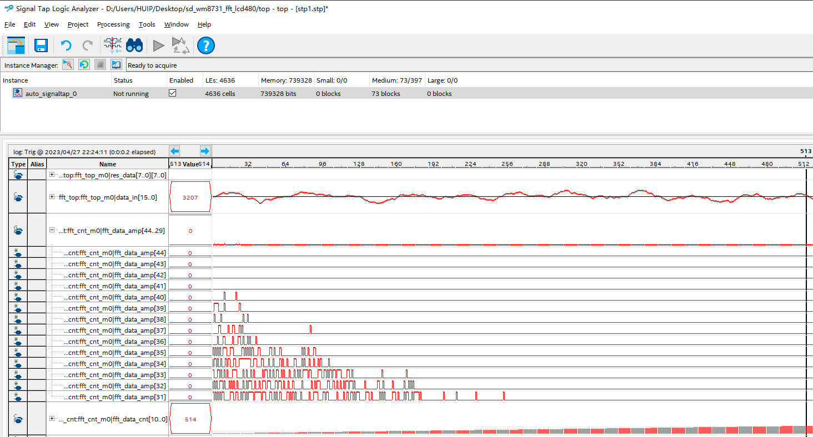
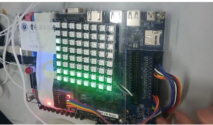

# 工程环境

+ FPGA开发板 ：友晶 DEC1 （不好用
+ 音频输入输出：WM8731
+ RGB阵列：WS2812 8X8
+ SD卡模块：SPI模式就行

# 下载现象

- 基于黑金的从SD卡读取WAV播放例程修改

  - 添加切歌功能（按键1

  - 添加调节音量功能（按键2

  - 添加FFT频谱显示（按键3 更改颜色

    

- 注：复位不太好使……暂时不明白，项目需要20K+LUT ，主要是FFT弄得太大了……

- 图一 ： FFT实时图  图2：实物演示

  

  # 版本更新

  20230428：初始版本，能亮就算成功，有机会再重新整理
