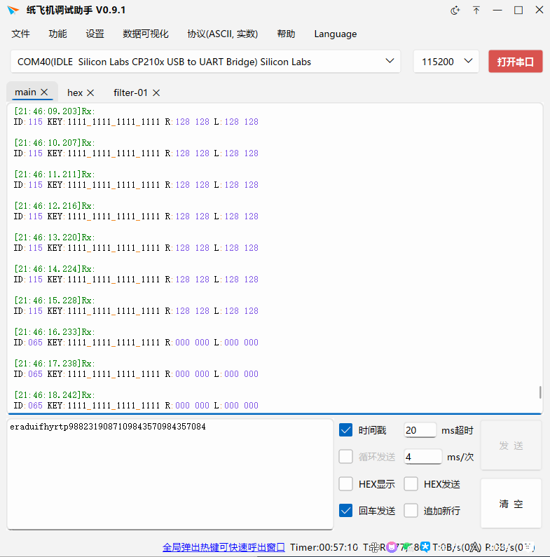

# 工程环境

+ FPGA开发板 ：AX301 （Cyclone IV )
+ PC端 支持UTF-8编码的串口助手
+ PS2手柄

# 下载现象

- 打开串口助手，自动输出当前按键状态
  - ID:xxx
    - 长按切换0x41和0x73
    - 0x41（十进制65），数字状态，此时摇杆模拟值变化不生效（摇杆按下的键值也不生效）；左摇杆上下左右推到底时，等同于上下左右十字键触发，右摇杆上下左右推到底，等同于△X□O触发（也就是会读到相同的键值）
    - 0x73（十进制115）,模拟状态，此时所有功能正常触发

  - KEY：xxxx_xxxx_xxxx_xxxx
    - xxxx，前四位分别为LT，RT，LB，RB（看不懂就百度这四个在哪儿
    - xxxx，然后四位是△、O、X、□
    - xxxx，然后四位是select、左摇杆按下、右摇杆按下、start
    - xxxx，最后四位是上、右、下、左

- R：xxx xxx
  - xxx，前一个xxx代表x轴偏移程度，从最左边到最右边对应0~255，回中是128
  - xxx，后一个xxx代表y轴偏移程度，从最上边到最下边对应0~255，回中是128

- L：xxx xxx
  - 同上

# 版本更新

250617：初始版本
